# Sampling Procedure

We employed an **Exponential Discriminative Snowball Sampling (EDSS)** procedure to identify Telegram channels constituting the *“critical patriotic”* segment of Russia’s pro-war infosphere.  
The method combined **algorithmic network expansion** based on repost ties with **manual exclusion** of nodes deemed irrelevant in terms of their communicative function or ideological alignment.

---

## 1. Sampling Design

The sampling proceeded in two iterative waves:

- **Seeds:** Four high-reach Telegram channels were selected as the initial “seed” nodes that best fit our theoretical definition of wartime *critical patriotism*:  
  - Konstantin Malofeev ([@kvmalofeev](https://t.me/kvmalofeev))  
  - Igor Strelkov ([@strelkovii](https://t.me/strelkovii))  
  - Direct Action⚡Z ([@adirect](https://t.me/adirect))  
  - Rybar ([@rybar](https://t.me/rybar))  

- **Time Frame:** February 24, 2022 – September 1, 2024.  

- **Inclusion Thresholds:**  
  - Wave 1 — ≥5 reposts  
  - Wave 2 — ≥10 reposts  

### Sampling Flow

```mermaid
flowchart TB

    A(["<b>EXPONENTIAL DISCRIMINATIVE<br/>SNOWBALL SAMPLING (EDSS)</b>"])

    R1["<b>ROUND 1</b><br/><i>Initial seed-based expansion</i><br/>Inclusion threshold: ≥5 reposts<br/>→ 190 channels identified"]
    F1["<b>MANUAL FILTERING R1</b><br/>→ 43 channels retained"]

    R2["<b>ROUND 2</b><br/><i>Network expansion</i><br/>Inclusion threshold: ≥10 reposts within R1<br/>→ 547 channels identified"]
    F2["<b>MANUAL FILTERING R2</b><br/>→ 78 channels retained"]

    FS(["<b>FINAL SAMPLE OF 78 CHANNELS</b>"])

    A --> R1 --> F1 --> R2 --> F2 --> FS

    %% --- Цвета и стили ---
    classDef head fill:#E4ECFF,stroke:#7997F0,stroke-width:1px,color:#1F2D5A;
    classDef round fill:#FFF3D6,stroke:#E5C56C,stroke-width:1px,color:#3A2D00;
    classDef round2 fill:#E4F4E8,stroke:#8EC397,stroke-width:1px,color:#1F3921;
    classDef filter fill:#F8F2E8,stroke:#D3BFA2,stroke-width:1px,color:#3A2D00;
    classDef final fill:#E4ECFF,stroke:#7997F0,stroke-width:1px,color:#1F2D5A;

    class A head;
    class R1 round;
    class F1 filter;
    class R2 round2;
    class F2 filter;
    class FS final;



```

---

## 2. Exclusion Criteria

In both waves, identical qualitative exclusion rules were applied to prevent the inflation of network density by channels that do not contribute to the measurement of *value-driven or identity-based communicative alignment*.  
Channels were **excluded** if they met any of the following criteria:

1. **News aggregators**, focusing exclusively on factual news dissemination (e.g., *RIA Novosti*).  
2. **Official or state-affiliated** channels representing government institutions or individual state officials (e.g., *Ministry of Defense of the Russian Federation*).  
3. **Foreign-focused** channels that do not cover Russian domestic politics or the Russia–Ukraine war (e.g., *Tales from the Favelas*, *Balkan Gossip*).  
4. **Irregularly reposted** channels — defined as those appearing in fewer than 3 out of 11 temporal quarterly snapshots, to exclude episodic, event-driven connections rather than sustained communicative ties.  
5. **Deleted, blocked, or private** channels.  

An example of the manual filtering process for R1 is available here:  
📄 [`Sampling_Manual_Filtering_R1_Example.csv`](
../data/Sampling_Manual_Filtering_R1_Example.csv)

---
